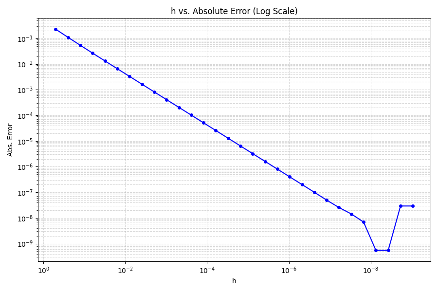

# About
 This program uses the Cleve Moler Algorithm to calculate machine precision. The input is hardcoded and the output is a single number ($eps$) representing machine precision.

# Results & Analysis
 * $eps = 2.220446049250313 \times 10^{-16}$
 * $\sqrt{eps} = 1.4901161193847656 \times 10^{−8}$

 * Visualizing the Relationship Between the Abs. Error and Decreasing $h$ Values:
 

 * Per the graph: As the value of $h$ gets smaller, the abs. error shrinks until it hits a mininum value, and then begins to increase again due to precision errors. 
 * The magnitude of the error reaches a minimum at an $h$ value around $2^{-27}$ or $2^{-28}$, with an abs. error of approximately $1.5 \times 10^{-8}$.
 * The minimum value for the magnitude of the error is almost exactly equal to $\sqrt{eps}$ (or $1.5 \times 10^{-8}$).


# Requirements

 * Java Development Kit 21
 * No libraries or built-in functions are required to execute the program

# Compilation

 The program can be compiled with the included Gradle wrapper by running:

 ```
 ./gradlew build
 ```

# Execution

 After compiling, the program can be executed with the Gradle run task:

 ```
 ./gradlew run
 ```

# Sample Execution & Output

 Sample Compilation:
 ```
 ./gradlew build
 ```

 Sample Execution:
 ```
 ./gradlew run
 ```

 Sample Output:
 ```
 2.220446049250313E-16
 ```